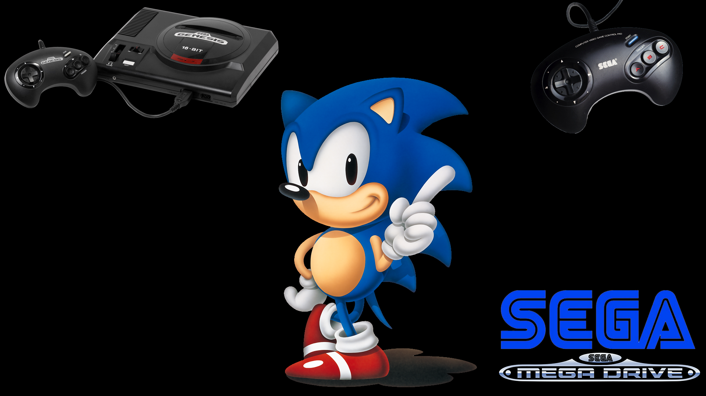
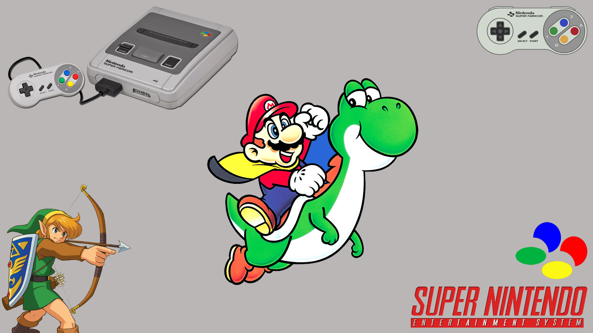
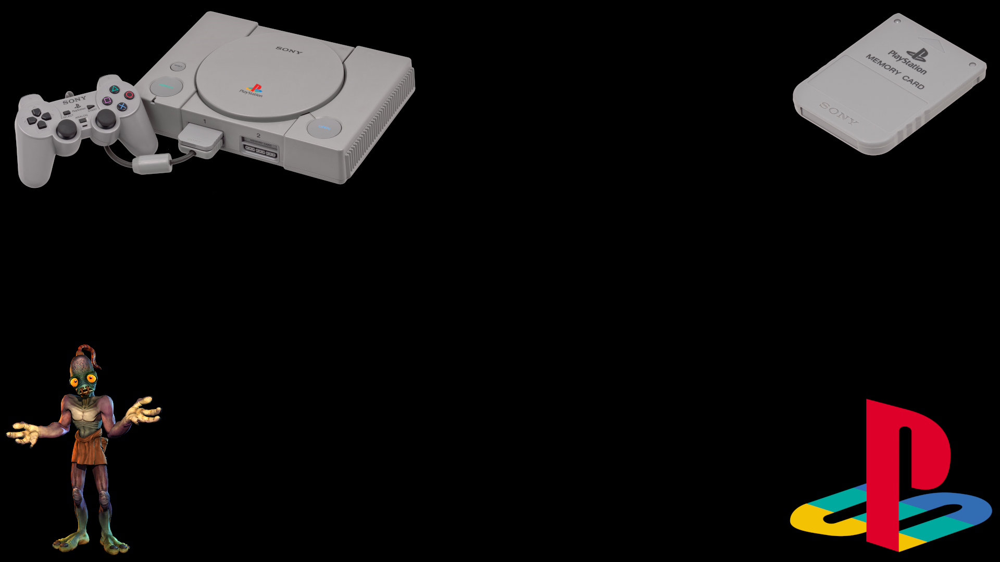

### Thèmes custom full HD ###

[!theme](docs/ES-logo.png)

<p float="left">
  
   
  
</p>


## DESCRIPTION

Full HD themes for Emulationstation frontend.

### THEMES

- [x] Nes
- [x] Game & watch
- [x] Gameboy
- [x] Snes
- [x] Nintendo64
- [x] Gamecube
- [ ] Nintendo DS
- [x] Psx
- [x] Ps2
- [x] Psp
- [x] Atari Lynx
- [x] Atari jaguar
- [x] Atari jaguar CD
- [x] Sega master system
- [x] Sega Genesis
- [ ] Sega Gamegear
- [x] Sega CD
- [x] Sega 32x
- [ ] Sega Saturn
- [ ] Sega Dreamcast
- [x] Mame
- [x] Neogeo
- [x] Pc DOS
- [ ] Apple II
- [ ] Pcengine
- [ ] Atari 5200
- [ ] Atari 7800
- [ ] Gameboy advance
- [ ] Scummvm
- [ ] Zx spectrum

## INSTALLATION

### LINUX

```bash
cd emulationstationThemes/
cp -r ./custom/ recalbox/share/system/.emulationstation/themes/
```

### WINDOWS

Copy custom in C:/Users/YourUser/.emulaionstation/themes/

## TODO

- [ ] Missing themes
- [ ] Add music
- [ ] Change font