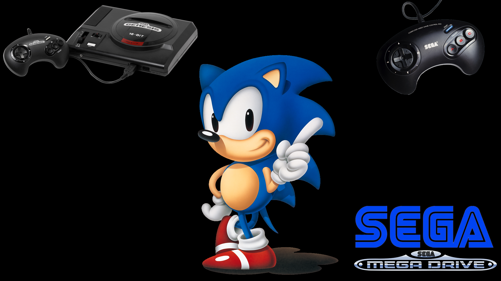
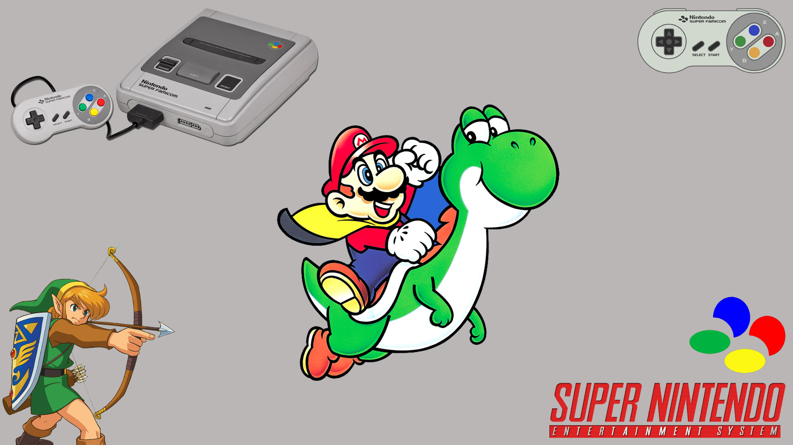
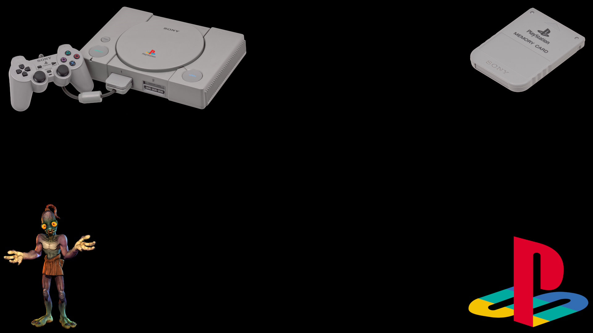
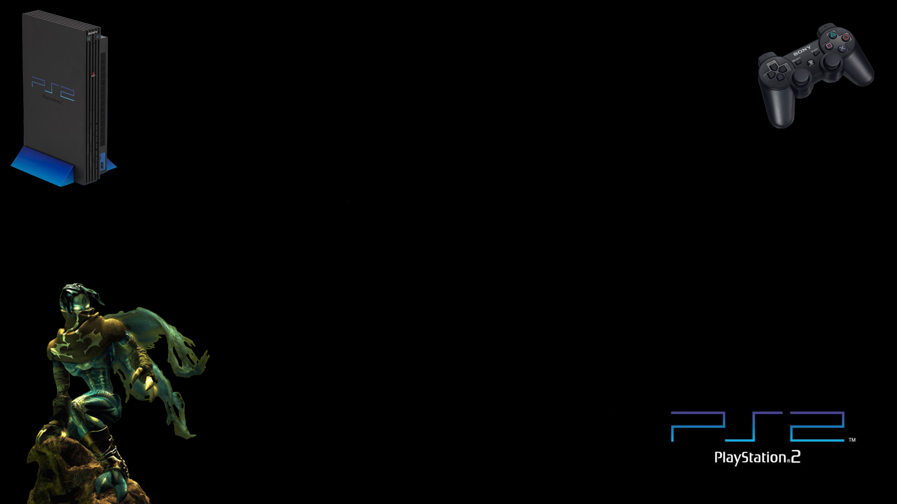

### Thèmes custom full HD ###


<p float="left">
  
   
  
  
</p>


## DESCRIPTION

Full HD themes for Emulationstation frontend.

### THEMES

- [x] Nes
- [x] Game & watch
- [x] Gameboy
- [x] Snes
- [x] Nintendo64
- [x] Gamecube
- [x] Psx
- [x] Ps2
- [x] Psp
- [x] Atari Lynx
- [x] Atari jaguar
- [x] Atari jaguar CD
- [x] Sega master system
- [x] Sega Genesis
- [x] Sega CD -> controller to add
- [x] Sega 32x
- [x] Mame
- [x] Neogeo
- [x] Pc DOS
- [ ] Favorites
- [ ] Moonlight
- [ ] Pcengine
- [ ] Atari ST
- [ ] Sega Gamegear
- [ ] Sega Saturn
- [ ] Sega Dreamcast
- [ ] Nintendo Family Disk System
- [ ] Nintendo DS
- [ ] Gameboy advance
- [ ] Gameboy color
- [ ] Apple II
- [ ] Amiga 600
- [ ] Atari 5200
- [ ] Atari 7800
- [ ] Commodore
- [ ] Scummvm
- [ ] Zx spectrum
- [ ] Solarus

## INSTALLATION

### THEMES

#### LINUX

```bash
cd emulationstationThemes/
cp -r ./greg-theme/ recalbox/share/themes/
```

#### WINDOWS

Copy greg-theme folder in C:/Users/YourUser/.emulaionstation/themes/

### MUSIC

```bash
cd emulationstationThemes/
cp -r ./greg-theme/ /recalbox/share/music/
```

#### WINDOWS

Copy music folder in C:/Users/YourUser/.emulaionstation/music/

## TODO

- [ ] Missing themes
- [x] Add music
- [ ] Change font